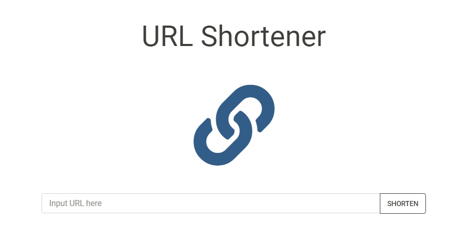
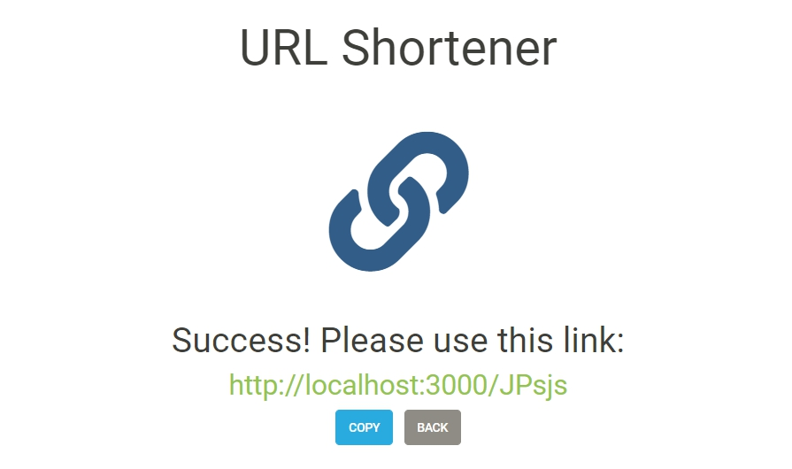

# 短網址產生器 (URL shortener)

縮短網址的工具

## 產品功能 (Features)
- 輸入網址後，按下「Shorten」按鈕，即可產生短網址
- 可使用短網址，連結至原本的網址

## 安裝 ( Installing )
1. 選定資料夾，開啟終端機，存放本專案
```
git clone https://github.com/yuchengH1988/URLshortener
```

2. 進入資料夾後，安裝套件
```
npm install
```

3. 啟動伺服器
```
npm run dev
``` 

4. 開始瀏覽器
```
在瀏覽器進入 http://localhost:3000
``` 

## 環境建置與需求 (prerequisites)
- Node.js 10.15.0
- mongoose 5.11.15
- express 4.17.1

## 預覽圖 ( preview image)

#### 首頁



#### 結果頁面



### 作者
[Calvin Huang](https://github.com/yuchengH1988)